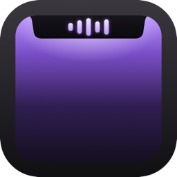
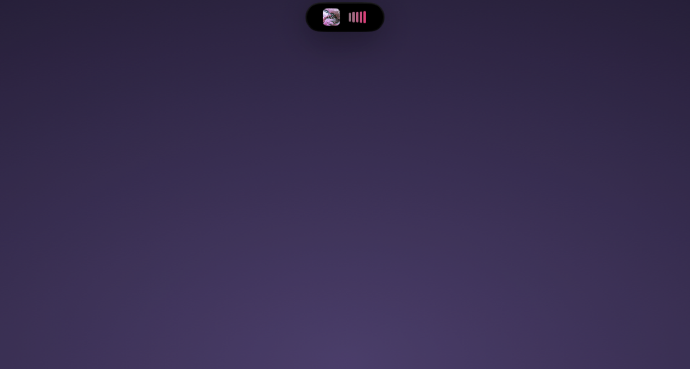

<p align="center">
  
</p>

<h1 align="center">Ledge</h1>

<p align="center">Your Mac's notch, doing something other than hiding a camera.</p>

<p align="center">
  
</p>

<p align="center">
  
  <br>
  <sub>Idle, it's a pill next to the menu bar. Hover, and it opens up.</sub>
</p>

I got tired of Apple's volume HUD punching a gray box into the middle of my screen every time I hit F11, so I built something to replace it. Then I kept adding to it — now-playing controls, a file shelf, a couple of things I use daily and one I use maybe once a week. It's a menu-bar app, no Dock icon, and it draws its own notch even on Macs that don't have a physical one.

Some of this is opinionated because I built it for myself first: the UI is in German, and the quick-capture feature assumes you're running Obsidian with daily notes. If neither applies to you, the media controls and file shelf still work fine without them.

## What it actually does

**Volume and brightness keys land in the notch instead of Apple's OSD.** This is the reason I open the app at all — a CGEvent tap grabs the hardware keys, CoreAudio handles the volume change directly, and Apple's overlay never shows up. Needs Accessibility permission.

Beyond that:

- Now-playing for Spotify and Apple Music, driven by AppleScript rather than MediaRemote — Apple sealed that framework off in macOS 15.4, which broke pretty much every third-party notch app overnight. AppleScript means polling every 5 seconds with local interpolation in between, not instant, but it survives OS updates that private APIs don't.
- A file shelf. Drag files onto the notch, drag them off later, wherever "later" ends up being. Tracked by bookmark, not path, so a rename or a reboot doesn't lose them.
- Obsidian quick capture: ⌥⌘Space, type, and it's appended under a heading in today's daily note without Obsidian needing to be open. Point it at your vault in Settings first.
- A pomodoro timer with named presets and auto-chaining, because I kept starting one in a phone app and then closing the phone app.
- Small live-activity banners for charging, AirPods connecting, a file landing in the shelf — a few seconds, then gone.

## Getting it running

Grab `NotchMate.zip` from the [latest release](../../releases/latest), unzip it, drag `NotchMate.app` into `/Applications`.

Gatekeeper will block the first launch — it's ad-hoc signed, since I'm not paying Apple 99 €/year to notarize a menu-bar toy. Either:

```sh
xattr -d com.apple.quarantine /Applications/NotchMate.app
```

or let it fail once, then *System Settings → Privacy & Security → Open Anyway*.

Needs macOS 14+. It adds itself as a login item on first launch, and asks for permissions only as you touch the features that need them: Automation the first time it talks to Spotify or Music, Accessibility if you turn on the volume-keys option.

One thing that's bitten me more than once: the Accessibility grant is tied to the app's code signature. Rebuild and reinstall from Xcode, and macOS leaves the checkbox checked in Settings while the actual permission is dead underneath it. If volume keys stop landing in the notch after a rebuild, remove the entry and re-add it — don't trust the checkbox.

## Building it yourself

```sh
xcodebuild -project NotchMate.xcodeproj -scheme NotchMate -configuration Debug build
```

Or `open NotchMate.xcodeproj` and hit ⌘R in Xcode 15+. No SPM, no CocoaPods — everything is a system framework, so there's nothing to fetch first.

Two things worth knowing before you dig into the source: brightness control resolves the private `DisplayServices` framework at runtime via `dlopen`, so if Apple ever pulls those symbols the feature quietly turns itself off and the regular brightness keys take back over — that's the bargain you make with private APIs, and I'm fine with it. The app also isn't sandboxed; half of what it does (Apple Events to Spotify, raw CoreAudio, the CGEvent tap) isn't possible inside one.

## The icon

`swift Tools/GenerateAppIcon.swift` renders the 1024 px master with Core Graphics — no Figma file, just gradients and a couple of paths. It's a MacBook display, dark bezel, with the notch cut into the top the same way the real app's `NotchShape` does, and a small glowing waveform sitting inside it — the one thing the app is always doing somewhere, whether that's audio or a volume nudge. Style is lifted without much shame from Alcove and Dynamic Lake.

## License

[MIT](LICENSE). Do whatever you want with it.
